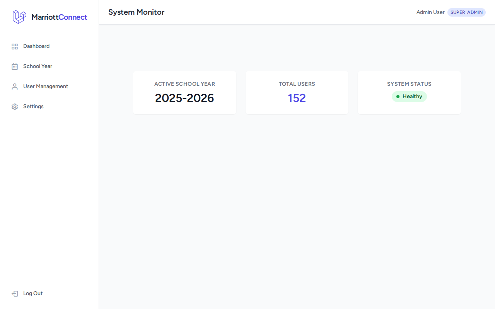
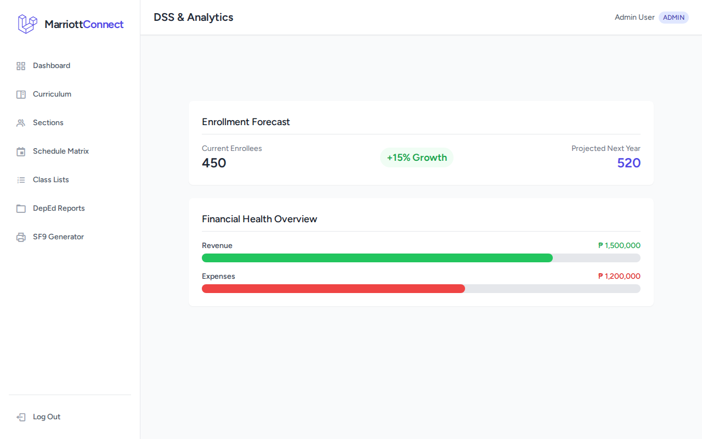
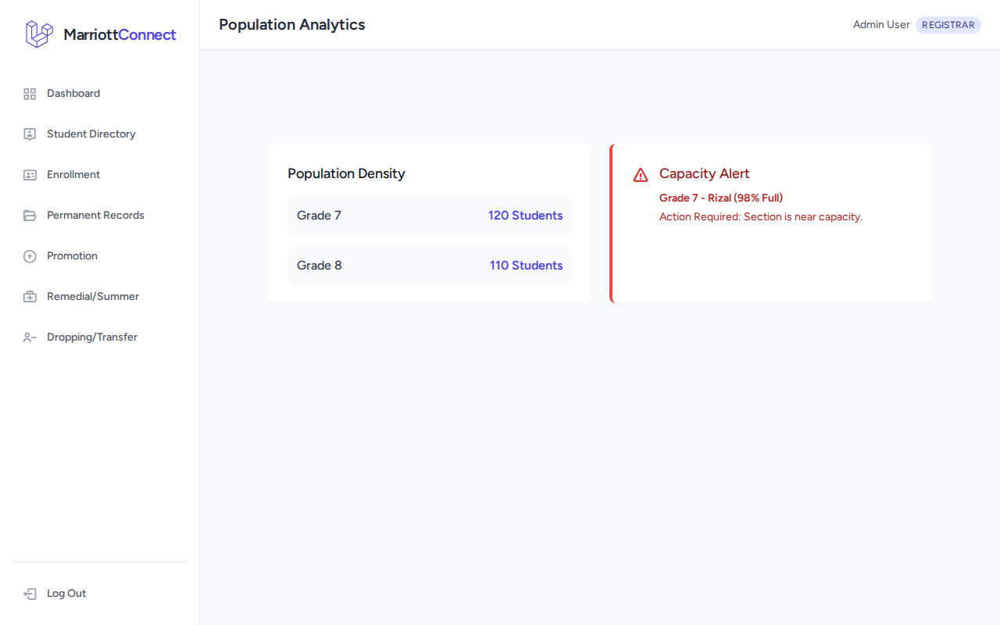
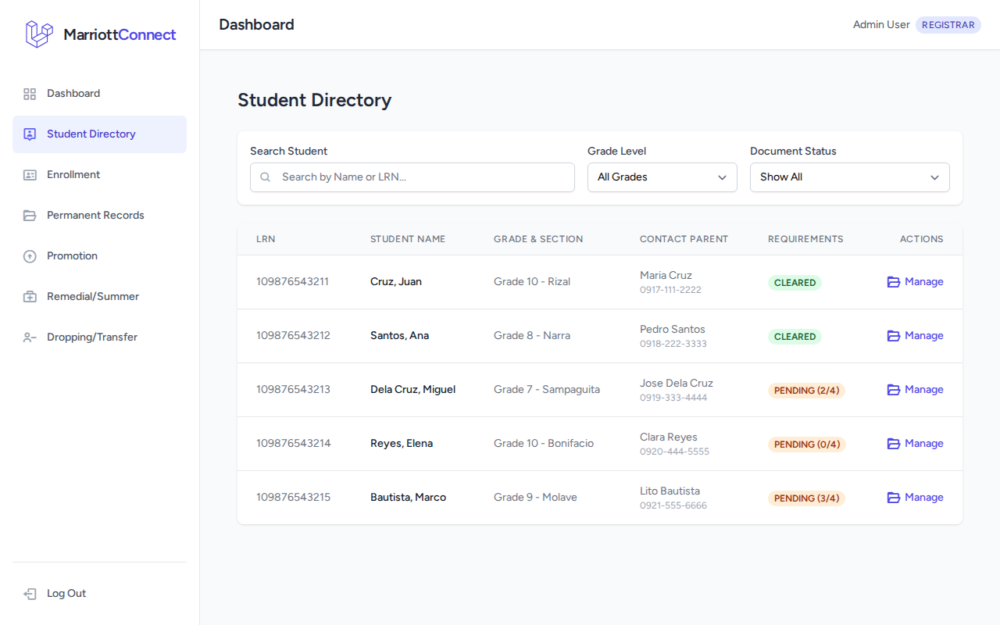
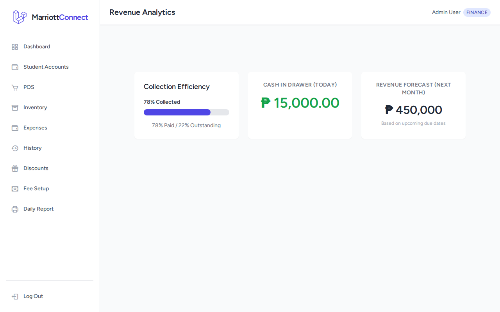
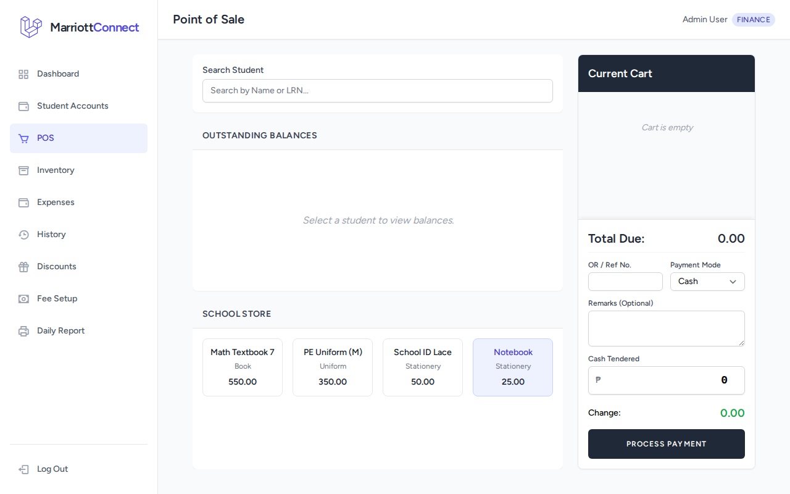
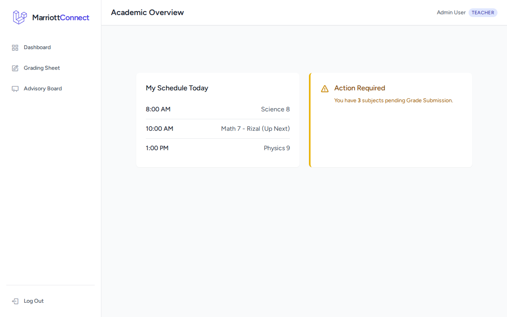
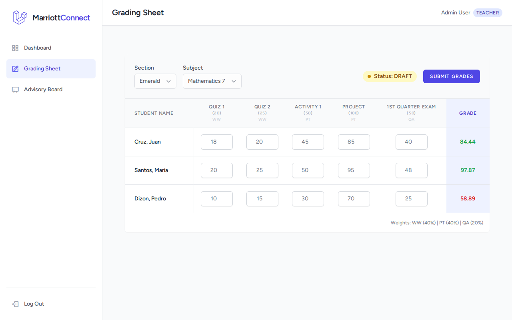
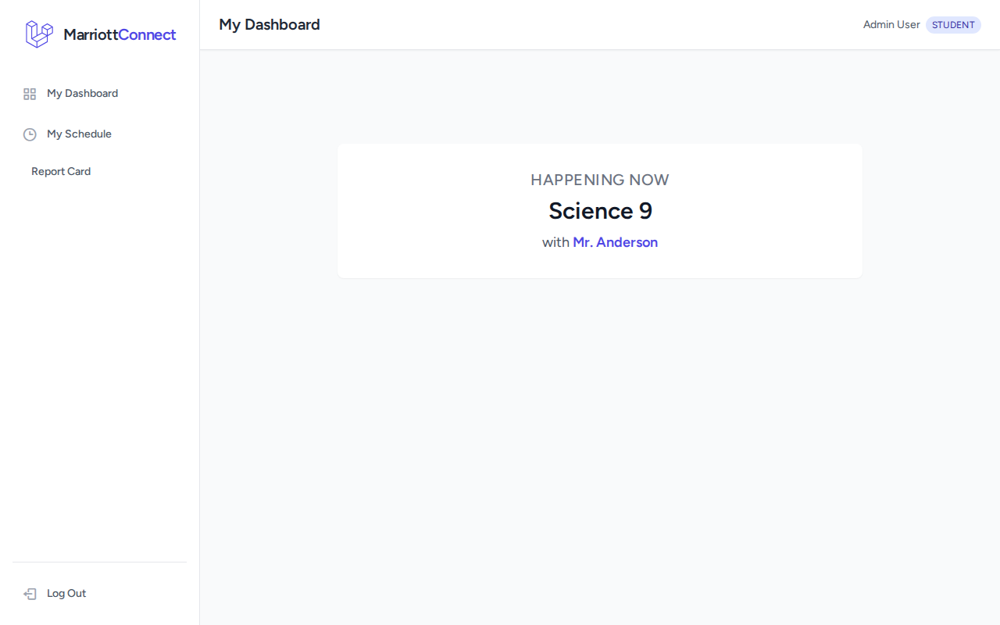

# MarriottConnect - School Management System

MarriottConnect is a comprehensive School Management System designed to streamline administrative, academic, and financial operations. It features a robust Role-Based Access Control (RBAC) system ensuring that Super Admins, Admins, Registrars, Finance Officers, Teachers, Students, and Parents each have a tailored interface suited to their needs.

**Note:** This application is currently in a **simulation state**, utilizing hardcoded data and logic to demonstrate the user interface and workflows without requiring a full database population for all modules.

## Technology Stack

- **Framework:** Laravel 12
- **Frontend:** Livewire 4, Alpine.js, Tailwind CSS
- **Database:** SQLite (for user authentication and core records)

## Key Features by Role

### 1. Super Admin
The Super Admin oversees the entire system configuration and user management.
- **User Manager:** Manage accounts and roles.
- **System Settings:** Configure global application settings.
- **School Year Manager:** Open/Close school years.



### 2. Admin
Admins handle the academic structure and reporting.
- **Curriculum Manager:** Manage subjects and grade levels.
- **Section Manager:** Organize classes and sections.
- **Schedule Builder:** Create class schedules.
- **Report Card Generator:** Generate SF9 and other DepEd reports.



### 3. Registrar
The Registrar module manages student lifecycles from enrollment to graduation.
- **Enrollment Wizard:** Step-by-step student enrollment.
- **Student Directory:** Comprehensive search and management of student records.
- **Historical Grades:** Permanent records and transcript management.
- **Batch Promotion:** Automated promotion logic.




### 4. Finance
The Finance module handles all monetary transactions with a strict color-coded ledger system.
- **Point of Sale (POS):** Single-page interface for payments (Green for Credit, Black for Debit, Red for Debt).
- **Student Ledger:** Real-time financial status of students.
- **Daily Remittance:** Cash vs. Digital transaction breakdowns.




### 5. Teacher
Teachers have tools to manage their classes and grades.
- **Grading Sheet:** Input grades for students (AO/SO/RO/NO for values).
- **Advisory Board:** Manage advisory class details.




### 6. Student
Students can access their academic info.
- **My Grades:** View current and historical grades.
- **Schedule:** View class schedule.



### 7. Parent
Parents can monitor their child's status.
- **Billing Details:** View statements of account and payment history.


## Installation & Setup

1. **Clone the repository**
2. **Install Dependencies:**
   ```bash
   composer install
   npm install && npm run build
   ```
3. **Setup Environment:**
   ```bash
   cp .env.example .env
   php artisan key:generate
   touch database/database.sqlite
   php artisan migrate
   ```
4. **Run the Application:**
   ```bash
   php artisan serve
   ```
5. **Login:**
   - Use the mock login or create a user via `php artisan tinker`.
   - Default simulated role switching is handled via the dashboard.

## Simulation Details

This project uses a unique simulation approach where specific pages (like dashboards) adapt based on the assigned role. The data presented in tables and charts is often hardcoded to provide a consistent and realistic demonstration of the UI capabilities without the need for extensive data entry.
